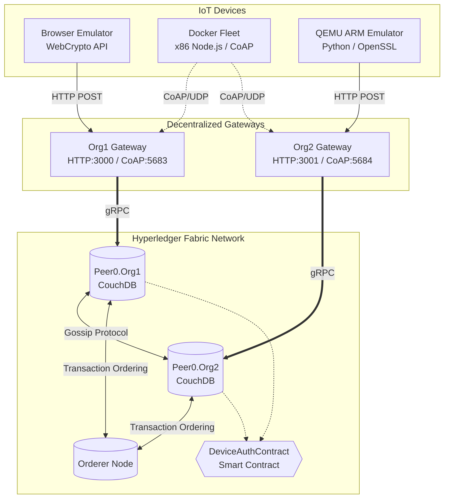
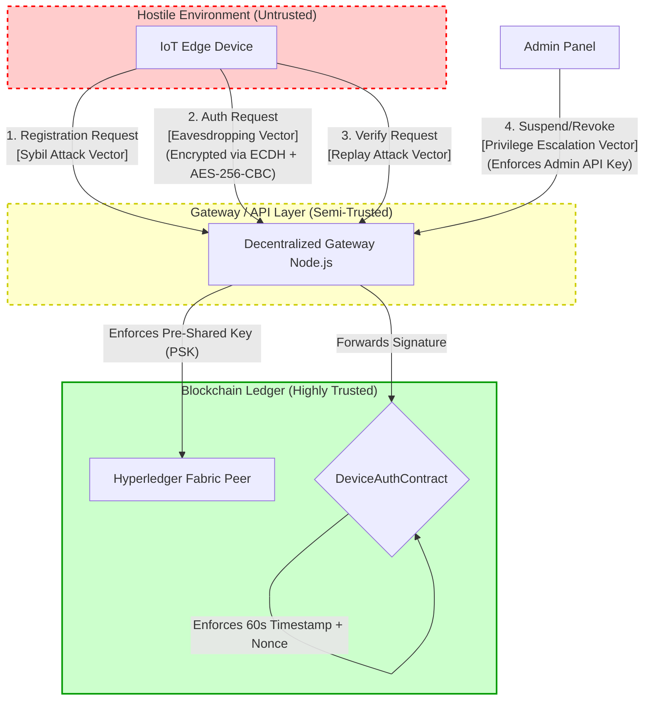
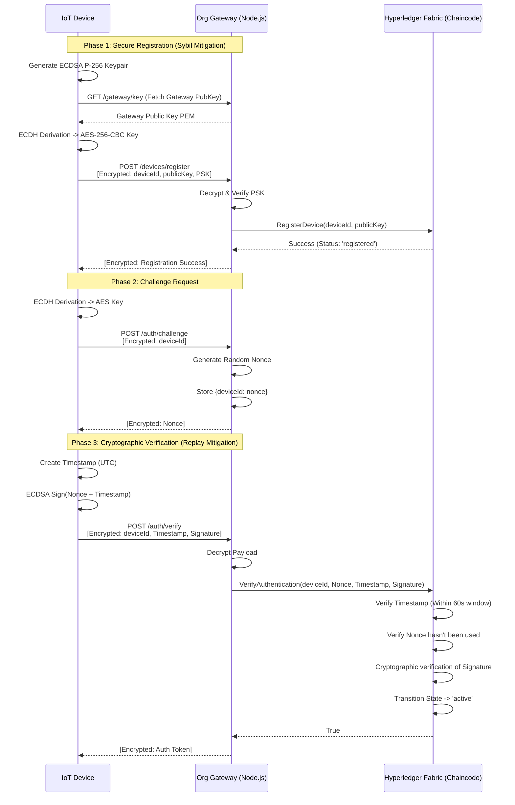
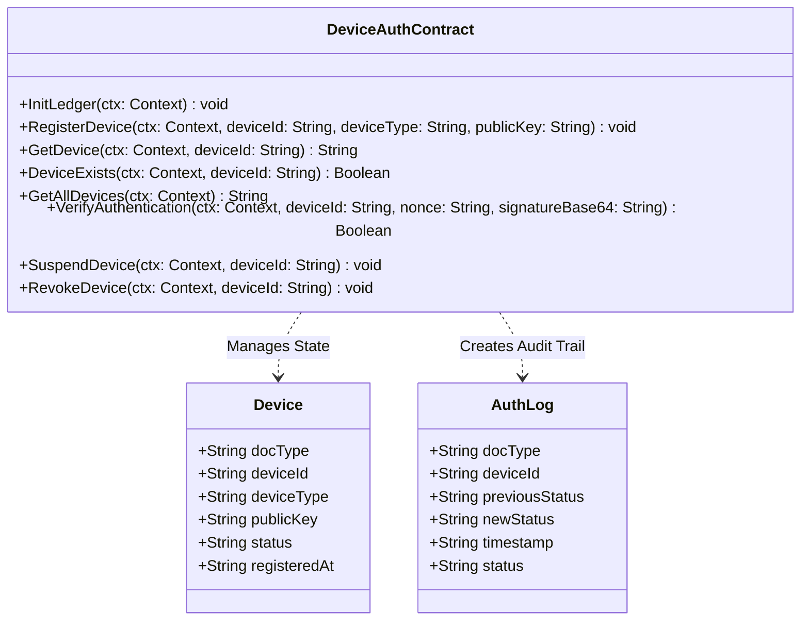
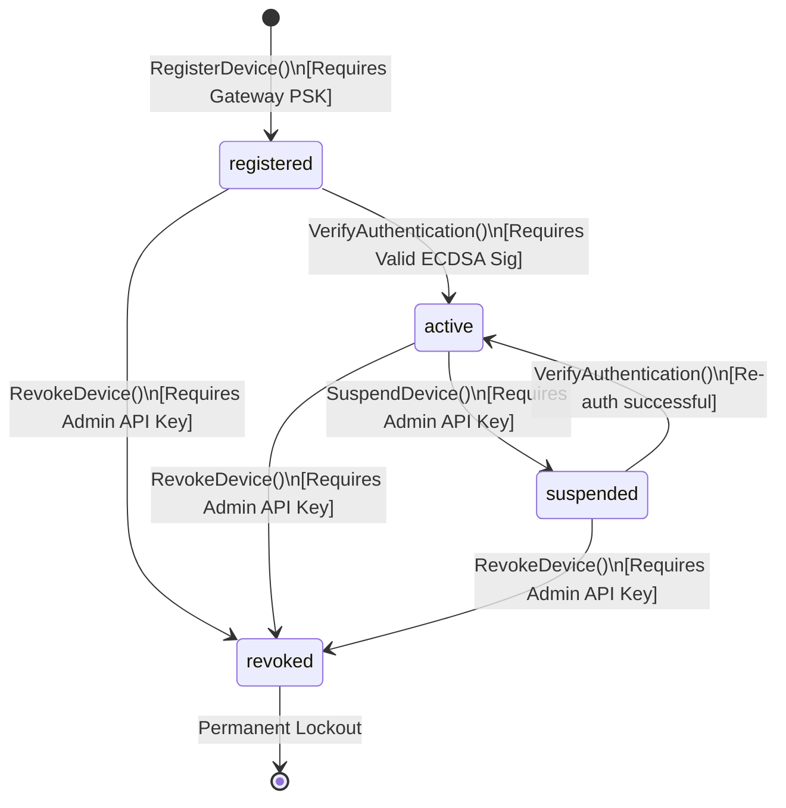
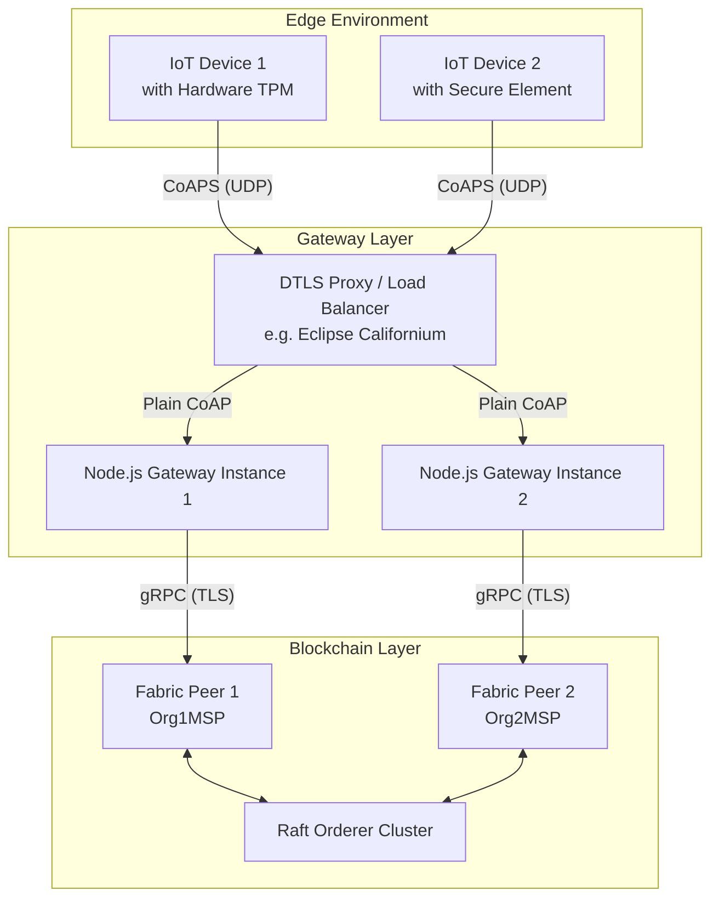

# Decentralized IoT Authentication Framework: UML Diagrams

## A. System Architecture Component Diagram
This UML deployment diagram illustrates the true decentralized nature of the framework. IoT devices are not bound to a single centralized server; instead, they can authenticate via multiple independent organization gateways (Org1 or Org2) that sync state via the Hyperledger Fabric blockchain.

## B. Threat Model & Trust Boundaries Flowchart

## C. Authentication Sequence Diagram (with Application-Layer Security)
This sequence diagram demonstrates the end-to-end security model, including Sybil attack mitigation (PSK), eavesdropping prevention (ECDH+AES), and replay attack mitigation (Nonces + 60s Timestamps).

## D. DeviceAuthContract chaincode Class Diagram
This UML Class Diagram outlines the properties of a `DeviceIdentity` asset on the ledger and the methods exposed by the `DeviceAuthContract` chaincode.

## E.  DeviceAuthContract chaincode Lifecycle State Machine 

## F. Future Work Component Diagram
